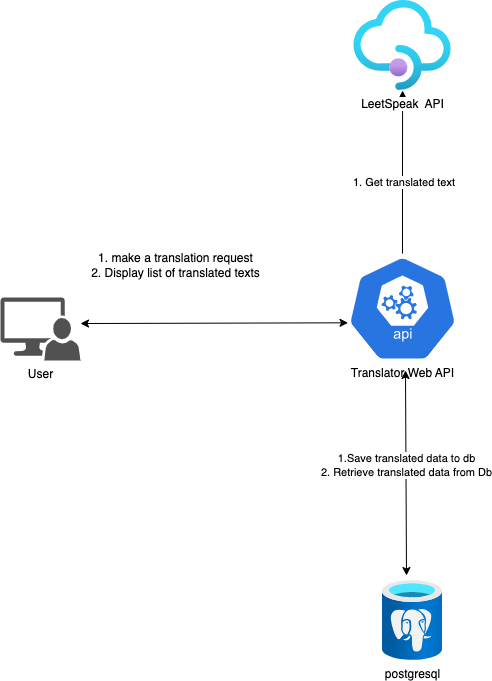

# Introduction
Enables a web user to translate any text to LeetSpeak

# Features
1. Retrieve Leetspeek translated text

# Architecture(s)
1. Tanslator Api: 

# Flow(s)
1. Tanslator logic flow: 

# How to Setup
1. Install any capable .NET IDE (Visual Studio or JetBrains Rider)
2. [Install docker here](https://docs.docker.com/engine/install/)

# How to Run
1. Open Solution in Visual Studio/Rider
2. Click Debug/Run

# Authors
1. Godwin Dorglo

